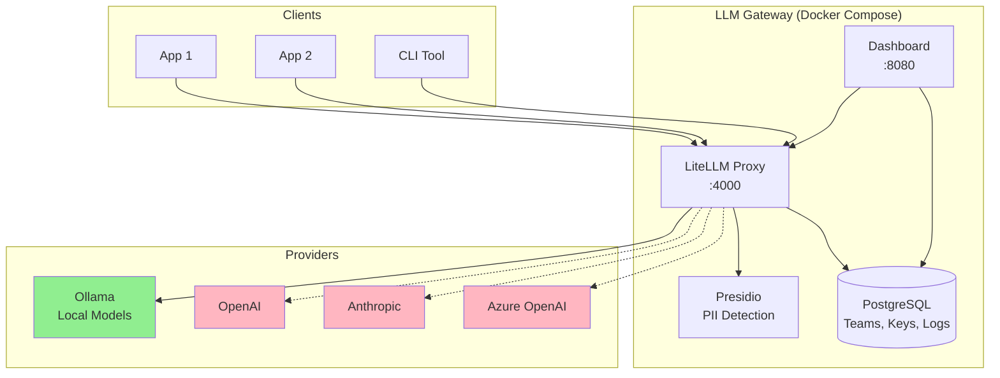

# LLM Gateway Kit

A drop-in, self-hosted LLM gateway for governing and observing how your team uses AI models. Stand it up in an afternoon, run it locally for free, and scale when you're ready.

```
┌─────────────────────────────────────────────────────────────────────────────┐
│                           LLM Gateway Kit                                    │
│                                                                              │
│   Your Apps ──► Gateway ──► Model Providers (OpenAI, Anthropic, Ollama)     │
│                   │                                                          │
│                   ├── Team/Key Management                                    │
│                   ├── Budget & Rate Limiting                                 │
│                   ├── PII Guardrails                                         │
│                   └── Observability Dashboard                                │
└─────────────────────────────────────────────────────────────────────────────┘
```

## Quick Start

```bash
# Clone and start
git clone <repo-url> && cd llm-gateway-kit
make up

# Generate demo traffic
make seed

# View dashboard
open http://localhost:8080
```

That's it. The gateway runs with a local Ollama model by default—no API keys required.

## What It Does

| Feature | Description |
|---------|-------------|
| **Unified Gateway** | Single endpoint for all LLM providers (OpenAI, Anthropic, local Ollama) |
| **Team Management** | Create teams, issue API keys, set budgets and rate limits |
| **PII Guardrails** | Presidio-based PII detection and redaction per team |
| **Observability** | Track who uses what, how much it costs, and what goes wrong |
| **Zero-Cost Default** | Works out of the box with local Ollama—add cloud keys when ready |

## Architecture



## Components

### Gateway (LiteLLM Proxy)
- **Model Routing**: Send requests to `smart` or `fast` and let the gateway pick the best available model
- **Fallback Chains**: If OpenAI fails, try Anthropic; if that fails, fall back to local Ollama
- **Virtual Keys**: Each team/user gets their own key with independent budgets

### Team & Key Management

```bash
# Create a team
make team NAME=engineering BUDGET=500

# Create a key for a user
make key TEAM=engineering USER=alice@example.com

# Or use the CLI directly
python cli/gateway_cli.py team create --name support --budget 100 --pii-guardrail
python cli/gateway_cli.py key create --team support --user bob@example.com
```

### Guardrails
- **PII Detection**: Presidio scans prompts for emails, phone numbers, SSNs, credit cards, and more
- **Per-Team Toggle**: Enable guardrails for support team, disable for engineering
- **Custom Recognizers**: Add your own patterns (employee IDs, project codes, etc.)

```python
# See guardrails/custom_recognizers.py for examples
from guardrails.custom_recognizers import EmployeeIDRecognizer
# Matches: EMP-12345, EMP-1234
```

### Observability Dashboard

The dashboard shows:
- **Usage by team/user/model** over time
- **Spend tracking** against budgets
- **Error rates** and recent errors
- **Guardrail triggers** (PII catches)

Access at `http://localhost:8080` after running `make up`.

### Evaluations

Run evals through the gateway to test model quality:

```bash
# Run eval suite (uses stub model in CI)
pytest evals/ --eval-mode --gateway-url=http://localhost:4000

# Add your own test cases in evals/cases/
```

## Configuration

### Environment Variables

Copy `.env.example` to `.env` and configure:

```bash
# Required
LITELLM_MASTER_KEY=sk-your-secure-key-here

# Optional: Add cloud providers
OPENAI_API_KEY=sk-...
ANTHROPIC_API_KEY=sk-ant-...
```

### Model Configuration

Edit `config/litellm_config.yaml` to:
- Add/remove model providers
- Configure fallback chains
- Adjust rate limits
- Enable/disable caching

### Privacy Settings

**By default, prompt and response bodies are NOT stored.** Only metadata is logged:
- Team/user attribution
- Model used
- Token counts and cost
- Latency
- Truncated preview (first 200 chars)

Teams can opt-in to full storage:
```bash
python cli/gateway_cli.py team update <team-id> --store-prompts true
```

## Design Decisions

### Why Gateway vs SDK-Level Controls?

| Approach | Pros | Cons |
|----------|------|------|
| **Gateway** | Centralized control, language-agnostic, easier to audit | Extra hop, single point of failure |
| **SDK Wrappers** | Lower latency, no extra infra | Per-language maintenance, harder to enforce |

We chose a gateway because:
1. **Consistency**: One place to enforce policies across all apps
2. **Visibility**: Central logging makes auditing straightforward
3. **Flexibility**: Switch providers without changing app code

### Why Postgres for Observability?

We considered:
- **Langfuse**: Great product, but adds another service to manage
- **OpenTelemetry + Grafana**: Powerful, but complex for a small team
- **Custom dashboard + Postgres**: Simpler stack, LiteLLM already uses Postgres

We went with a simple FastAPI dashboard querying LiteLLM's spend tables plus our custom request log table. Fewer moving parts, easier to understand and customize.

### Why Presidio for PII?

- **Open source**: No vendor lock-in
- **Extensible**: Easy to add custom recognizers
- **Well-tested**: Microsoft-maintained, battle-tested
- **Language-agnostic**: Works on any text

**Important**: The PII guardrail demonstrates the pattern. It does NOT guarantee compliance with HIPAA, GDPR, SOC 2, or any other regulation. Compliance requires much more than string matching.

### Privacy Default

Prompt bodies can contain sensitive information. Storing them creates risk. So:
- **Default**: Store only metadata and truncated previews
- **Opt-in**: Teams explicitly enable full storage if needed

This respects user privacy while maintaining useful observability.

## API Reference

The gateway exposes the standard OpenAI-compatible API:

```bash
# Chat completion
curl http://localhost:4000/v1/chat/completions \
  -H "Authorization: Bearer YOUR_API_KEY" \
  -H "Content-Type: application/json" \
  -d '{
    "model": "smart",
    "messages": [{"role": "user", "content": "Hello!"}]
  }'
```

See [LiteLLM docs](https://docs.litellm.ai/) for full API reference.

## Makefile Commands

| Command | Description |
|---------|-------------|
| `make up` | Start all services |
| `make down` | Stop all services |
| `make logs` | Follow logs |
| `make seed` | Generate demo traffic |
| `make test` | Run tests |
| `make team NAME=x BUDGET=y` | Create a team |
| `make key TEAM=x USER=y` | Create an API key |
| `make health` | Check gateway health |
| `make models` | List available models |

## Running Tests

```bash
# Unit tests (no gateway needed)
pytest tests/test_unit.py -v

# Integration tests (requires running gateway)
make up
pytest tests/test_integration.py -v -m integration

# Eval suite
pytest evals/ --eval-mode -v
```

## Known Limitations

1. **Single-region**: No built-in multi-region support
2. **No SSO**: Teams/keys are managed via CLI, not integrated with IdP
3. **Basic alerting**: No Slack/email alerts for budget thresholds (yet)
4. **Materialized views**: Dashboard aggregations require manual refresh for large datasets
5. **PII detection**: Pattern-based; won't catch all PII in all languages

## Extending the Gateway

### Adding a Model Provider

1. Add credentials to `.env`
2. Add model definition to `config/litellm_config.yaml`
3. Restart: `docker compose restart litellm`

### Adding Custom Guardrails

1. Create a recognizer in `guardrails/custom_recognizers.py`
2. Register it with Presidio (see examples in file)
3. Update `config/litellm_config.yaml` to include new entity types

### Adding Dashboard Features

The dashboard is a simple FastAPI app. Add new endpoints in `dashboard/app.py` and templates in `dashboard/templates/`.

## File Structure

```
llm-gateway-kit/
├── config/
│   └── litellm_config.yaml    # LiteLLM configuration
├── db/
│   └── init.sql               # Database schema
├── guardrails/
│   ├── custom_callback_handler.py  # Observability logging
│   └── custom_recognizers.py       # Custom PII patterns
├── cli/
│   └── gateway_cli.py         # Team/key management CLI
├── dashboard/
│   ├── app.py                 # Dashboard API
│   └── templates/             # Dashboard UI
├── evals/
│   ├── gateway_eval.py        # Eval framework
│   └── cases/                 # Test cases
├── tests/
│   ├── test_unit.py           # Unit tests
│   └── test_integration.py    # Integration tests
├── scripts/
│   └── seed_traffic.py        # Demo traffic generator
├── docker-compose.yml
├── Makefile
└── .env.example
```

## Cursor Hook Integration

The kit includes a Cursor hook that checks prompts for PII before they're sent to the model, using the same Presidio rules as the gateway.

```bash
# Install to your project
mkdir -p .cursor/hooks
cp integrations/cursor-hook/pii_guard.py .cursor/hooks/
cp integrations/cursor-hook/hooks.project.json .cursor/hooks.json
```

See [`integrations/cursor-hook/README.md`](integrations/cursor-hook/README.md) for full documentation.

Key features:
- Uses the same Presidio analyzer as the gateway (policy in one place)
- Blocks prompts containing PII with a clear message listing entity types (never values)
- Configurable fail-open (default) or fail-closed behavior
- Block events logged to the observability dashboard

## Verified Behaviors

The following behaviors have been tested against a live Docker stack:

| Behavior | Status | Evidence |
|----------|--------|----------|
| **Disallowed model rejected** | ✓ Verified | Team restricted to `local/small` gets `403 team_model_access_denied` when requesting `openai/gpt-4o` |
| **Allowed model works** | ✓ Verified | Same team can successfully use `local/small` |
| **Request logs carry team/user** | ✓ Verified | `LiteLLM_SpendLogs` shows `team_id`, `team_alias`, and `user` fields populated |
| **Privacy default** | ✓ Verified | Schema has `store_prompts BOOLEAN DEFAULT false` |
| **Dashboard shows usage** | ✓ Verified | `/api/summary` returns request counts, tokens, and team breakdowns |
| **Cursor hook events logged** | ✓ Verified | POST to `/api/hook-events` records events visible in `/api/guardrails` |
| **PII detection (Presidio)** | ✓ Verified | Presidio analyzer detects PERSON, EMAIL_ADDRESS entities |

**Tests run:**
```bash
pytest tests/test_integration.py -v  # 12 passed
```

## What's Next

If this were a real production deployment, I'd add:

1. **Alerting**: Slack/email when teams hit budget thresholds
2. **SSO Integration**: OIDC/SAML for team management
3. **Caching**: Redis cache for repeated queries
4. **Rate Limiting UI**: Visual rate limit configuration
5. **Audit Log Export**: S3/GCS export for compliance
6. **Multi-region**: Deploy in multiple regions with read replicas

## License

MIT

---

*Built as a portfolio project demonstrating production patterns for LLM governance and observability.*
